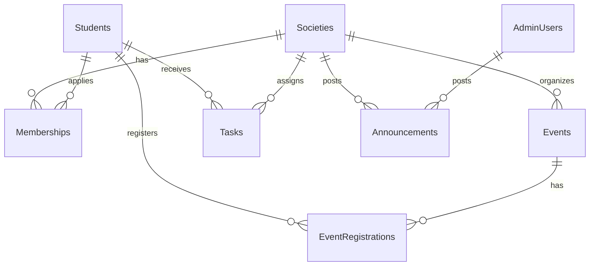

# SE-4011 Project Report (FAST Societies Management System)

## 1) Generated Application + Schema
- Tech: C# WinForms (.NET 8), SQL Server.
- Project: `FAST.Societies.Desktop`
- Schema script: `Database/FASTSocietiesDB.sql`

### ERD (Mermaid)

## 2) Cyclomatic Complexity + Test Cases
See: `analysis/cyclomatic_testcases.csv`

## 3) Best Module Justification (Structural Metric)
Metric used: `Avg Cyclomatic Complexity per feature`.
Best feature: `Society Management` (lowest average complexity with complete CRUD coverage).
See: `analysis/feature_comparison.csv`

## 4) CK Metrics
See: `analysis/ck_metrics.csv`

Answers:
- Maximum DIT: `1`
- Highest WMC: `Form1 (14)` due to UI orchestration and event handlers.
- Lowest WMC: `Models classes (1 each)` because they are data-only records.
- Class with greatest NOC: `none (0)` no deep inheritance used.
- Most complex class: `Form1`
- Most coupled class: `SqlRepository` (DB + model interactions)
- Least cohesive class: `Form1` (mixed UI flows for 3 roles)

## 5) Fault Injection Reliability
Assumption: for each function/module, injected faults `m=5`, threshold `E=1`.
Reliability probability: `P(X<=1)`, using Poisson with `lambda` = detected residual fault estimate.
See: `analysis/fault_injection_reliability.csv`

Most reliable: `GetSocieties`
Least reliable: `BuildAdminTab`

## 6) KLM Usability Evaluation
Operators:
- K = 0.28s
- M = 1.35s
- P = 1.10s
- H = 0.40s

See: `analysis/klm_ui.csv`

## 7) COCOMO Model
Selected model: `Organic` (small academic team, familiar domain, moderate complexity desktop app).
Effort:
- KLOC = from codebase
- PM = 2.4*(KLOC^1.05)
- TDEV = 2.5*(PM^0.38)
See computed values in: `analysis/cocomo.md`

## 8) Documentation Ratio
Formula: `Documentation Ratio = Total LOC / Commented Lines`
See: `analysis/documentation_ratio.md`
